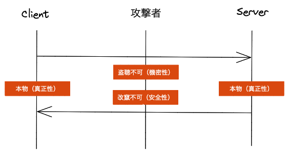

# TLSで学ぶ暗号技術

## 情報セキュリティーと暗号技術

情報セキュリティとは、情報の機密性、安全性、及び可用性を維持すること。さらに真正性、責任追跡性、否認防止、信頼性などの特性を維持することを含めることもある。  
暗号技術とは、暗号化、復号、認証、MAC(メッセージ認証コード)、ハッシュ、署名、鍵共有などを総称したものである。  
情報セキュリティの中でも、機密性、安全性、真正性を満たすために暗号技術が利用される。

<table>
<tr>
<td>機密性</td>
<td>認可した人以外はアクセスできない事。秘匿性。</td>
</tr>
<tr>
<td>安全性</td>
<td>データは改竄や削除がされていない事。</td>
</tr>
<tr>
<td>真正性</td>
<td>その人が本物であること。</td>
</tr>
</table>

## 安全な通信をするために必要なもの

- 平文をそのまま送ると盗聴されるので、平文を暗号化する必要がある。
- どうやって暗号化する? その暗号文は解読されない?
- 暗号化するにはなんかしらの鍵が必要。
- その鍵はどうやって作る? 攻撃者が鍵を予想できたらまずい。
- 届いた暗号文を読むためには平文に戻すための鍵が必要がある。
- 暗号化と同じ鍵で復号する? 違う鍵でする?
- 暗号と復号で同じ鍵を使うとする(共通鍵暗号)と事前に鍵の共有が必要がある
- 安全じゃないオンライン上で暗号化もまだできないのにどうやって安全に共有する?
- 安全ではない通信でなんかしらデータを受け渡しして、お互い同じ鍵を生成する必要がある(DH鍵共有)
- そんな手品みたいな方法があるのか。。
- 今鍵共有している通信相手って本当にその人?もしかしたら偽物(攻撃者)かも?
- 鍵共有している通信相手が本物であるという証明が必要(証明書・公開鍵基盤)
- その証明書って本物?
- 鍵共有できて暗号化されて届いたメッセージって正しい? 途中で暗号文が別の暗号文に置き換えられているかも?
- メッセージが改竄されてないことを証明/検証する仕組みが必要



## TLS概要

- 安全でないインフラ上で安全に通信するためのセキュリティプロトコル
- 盗聴、改ざん、メッセージの偽造を防止するように設計された方法で通信できる
- アプリケーション層のデータを分割し、データを保護してトランスポート層に転送する
- TLSは主にレコードプロトコルとそのサブプロトコルであるハンドシェイクプロトコルで構成される

## ネットワーク階層からみるTLS

<table>
<tr>
<th>階層名</th>
<th>説明</th>
<th>プロトコル</th>
</tr>
<tr>
<td>アプリケーション層</td>
<td>アプリケーションデータを扱う</td>
<td>HTTP</td>
</tr>
<tr>
<td>プレゼンテーション層</td>
<td>データの表現、変換、暗号化を扱う</td>
<td>SSL/TLS</td>
</tr>
<tr>
<td>セッション層</td>
<td>複数のコネクションを管理</td>
<td>-</td>
</tr>
<tr>
<td>トランスポート層</td>
<td>データ通信の制御</td>
<td>TCP</td>
</tr>
<tr>
<td>ネットワーク層</td>
<td>インターネットワークでの通信</td>
<td>IP</td>
</tr>
<tr>
<td>データリンク層</td>
<td>ローカルなデータリンクにおける通信(LAN)</td>
<td>Ethernet</td>
</tr>
<tr>
<td>物理層</td>
<td>物理的なデータのやり取り(ケーブル)</td>
<td>CAT5</td>
</tr>
</table>

## レコードプロトコル

- ペイロードに上位プロトコルであるハンドシェイクプロトコル、アラートプロトコル、暗号仕様変更プロトコル、アプリケーションデータプロトコルをカプセル化する
- 主な役割
  - 適切なレコードの分割
    - レコードサイズが 16384 バイトに収まるようにデータを分割し、一つのレコードを作成する
    - 各レコードのヘッダーにコンテントタイプ、プロトコルのバージョン、レコード長、ペイロードに分割したアプリケーションデータが格納される
  - ペイロードの保護/脱保護
    - ハンドシェイク時にClient-Server間で取り決めした暗号方式で暗号化する
    - TLS1.3の暗号方式ではAEAD(認証付き暗号)が必須になった
    - AES-GCMやCHACHA20_POLY1305など
    - ハンドシェイクのClientHelloとServerHelloは暗号方式の取り決めや鍵共有をする必要があるので暗号化はされない
    - それ以降は暗号化される
  - 安全性の検証
  - 次のネットワークレイヤにデータの転送を行う

```
struct {
  ContentType type;
  ProtocolVersion legacy_record_version; uint16 length;
  opaque fragment[TLSPlaintext.length];
} TLSPlaintext;
enum {
  invalid(0),
  change_cipher_spec(20),
  alert(21),
  handshake(22),
  application_data(23),
  (255)
} ContentType;
 
```

## ハンドシェイクプロトコル

## ClientHelloメッセージ

- 必要なフィールドはRandom、 CipherSuite、Extensionの3つのみ
- 他にもフィールドがあるがTLS1.3では利用しない
  - session IDやVersion(プロトコルバージョン)はダミー値が入る
  - 利用しないフィールドを残す理由は相互運用上の都合のため
- Randomフィールド
  - 32バイトの暗号学的にランダムなデータを格納する
  - ハンドシェイクを一意にする
- CipherSuiteフィールド
  - クライアントが対応可能な暗号スイートを優先度順に提示
  - TLS1.3で使える暗号スイートは5つのみ。どれもAEAD(認証付き暗号)で
    - TLS_AES_128_GCM_SHA256
    - TLS_AES_256_GCM_SHA384
    - TLS_CHACHA20_POLY1305_SHA256
    - TLS_AES_128_CCM_SHA256
    - TLS_AES_128_CCM_8_SHA256
- Extensionフィールド
  - 拡張
  - supported_groups
    - 提案する鍵交換アルゴリズムを順番に並べる
    - 前方秘密(PFS)がある鍵交換アルゴリズムのみ使用可能
      - DHEおよびECDHEのみ
      - RSAや静的DHは使えない
  - key_share
    - 鍵交換アルゴリズム(group)とそれに必要なに必要な情報(Key Exchange)をセットで任意数提供する。
  - supported_versions
    - 本当のバージョン番号はここで提示される

## ServerHelloメッセージ

- Clientとほぼ同じ構造
- 決定した暗号スイートと鍵交換方式などをクライアントに返す

## 鍵交換方式DHEの仕組み

TODO
https://milestone-of-se.nesuke.com/nw-basic/tls/diffie-hellman-summary/  
これ読む。 DHEパラメータの仕様
https://datatracker.ietf.org/doc/html/rfc7919

## 暗号スイートAES_GCMの仕組み

## Certificateメッセージ

- 証明書の送信
- 認証。真正性。
- 基本サーバー証明書のみ
- 暗号化されて送られる

## 証明書の検証

- OSに用意されたルートCA証明書を利用して、サーバ証明書を本物かどうか検証する
- TODO: 検証の仕方

## CertificateVerifyメッセージ

- 秘密鍵の証明
- 暗号化されて送られる

## Finishedメッセージ

- ハンドシェイクの一連のメッセージの完全性を検証
- 暗号化されて送られる

## まとめ

TODO

# RFC

TLS1.2: https://datatracker.ietf.org/doc/html/rfc5246
TLS1.3: https://datatracker.ietf.org/doc/html/rfc8446
暗号と認証の仕組みがわかる教科書 プロフェッショナルSSL/TLS 暗号技術入門 【図解】ネットワーク/サーバ/セキュリティの基礎から応用まで


