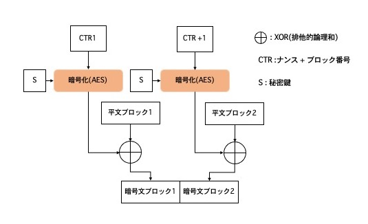

# TLSで学ぶ暗号技術

https://qiita.com/shun_takagi/items/eb46e0c1f0bb512fa04d  
の下書き

# 概要

HTTPS(`https://`)
での通信は暗号化されていて安全ということは多く人は知っていると思いますが、それがどのような仕組みで成り立っているのかを知らないという人は少ないと思います。特にフロントエンドエンジニアとして日頃業務を行っている中では、あまり触れる機会はないですよね。今回の記事では、そのような人たちに向けて、HTTPSでの通信の仕組みやそこで使われている暗号技術について自分が学んだことを書いています。

# TLSとは

インターネットの仕組みの根幹であるTCP/IPプロトコルではセキュリティが考慮されていません。その上に成り立っているHTTPプロトコルも本来は安全ではありません。こうした安全ではない基盤の中でセキュアな通信を実現するために生まれたのがTransport
Layer Security (以下 TLS)というプロトコルです。  
TLSはネットワーク階層で見るとプレゼンテーション層に位置します。データ送信時には上層から受け取った平文を暗号化処理をして下層に転送、逆にデータ受信時には下層から暗号データを受け取り復号して上層(アプリケーション層)
に渡すことがTLSの主な役目です。しかし暗号化だけすれば良いわけではなく、セキュアな通信ためには様々な仕組みが必要になります。


# 情報セキュリティーと暗号技術

セキュアな通信を実現するのがTLSなのですが、そもそもセキュリティとはなんでしょうか?    
日本産業規格（JIS）では以下のように定義されています。
> #### 情報セキュリティ (JIS Q 27000)
> 情報の機密性、安全性、及び可用性を維持すること。さらに真正性、責任追跡性、否認防止、信頼性などの特性を維持することを含めることもある。

TLSでは、情報セキュリティの中でも主に機密性、安全性、真正性、否認防止を満たすために設計されてます。 そしてそのような性質を満たすために様々な暗号技術が組み合わせて使われているのです。

<table>
<tr>
<th>要件</th>
<th>特製</th>
<td>暗号技術例</td>
</tr>
<tr>
<td>機密性</td>
<td>認可した人以外はアクセスできない事。秘匿性。</td>
<td>共通鍵暗号、公開鍵暗号</td>
</tr>
<tr>
<td>安全性</td>
<td>データが改竄や削除がされていない事。</td>
<td>メッセージ認証コード、デジタル署名</td>
</tr>
<tr>
<td>真正性</td>
<td>人やものが本物であること。</td>
<td>メッセージ認証コード、デジタル署名、証明書、公開鍵基盤(PKI)</td>
</tr>
</table>

# 秘密の文通

より具体的にセキュアな通信についてどのようなものかイメージしやすいように、まずはアナログな秘密の文通について考えてみます。

> アリスとボブは文通をしていて、内容を誰にもわからないように暗号化してやりとりしたいと考えています。    
暗号化の方法をいくつか調べました。
>
> 一つ目の方法はシフト暗号と言うものです。  
> 文字を数文字シフトさせ暗号化する方法で、例えば3つシフトする場合は「あ」は「え」に、「い」は「お」に置き換えて暗号文を作成します。暗号文を復号する場合は同じ分だけ逆にシフトします。
>
>もう一つの方法は換字式暗号といい、それぞれの文字に対応する換字表を使い「あ」に対応する文字は「さ」、「い」に対応する文字は「す」というでたらめに変換して暗号文を作る方法です。暗号文を復号する場合は同じ換字表を使い平文に戻します。
>
> シフト暗号の方が復号しやすいためお互いに手紙も読みやすくなりますが、規則性があるので暗号文の解読もされやすくなってしまいます。換字式暗号の方が幾分解読しづらそうです。アリスとボブは話し合って、換字式暗号で暗号化することを決めました。
>
> 換字式暗号の場合に絶対バレてはいけない情報が換字表です。換字表はアリスとボブの両方が同じものを持つ必要があります。共有する際に換字表を郵送で送ると途中でばれたり、すり替えられたりする可能性があるので、直接会ってコピーを渡すことにしました。
>
> 極秘情報を共有できたことで晴れて二人だけしか知らない暗号文で文通ができます。
>
> しかし、まだ問題があります。暗号文を作ったのはいいものの、その暗号文自体が誰かに改竄されてしまう可能性があります。すると復号したときに全く違う文章になってしまい、意図してないメッセージが伝わってしまうかもしれません。  
そこでお互いが書いた暗号文ということしっかしわかるように、ワープロではなく手書きにし、サインを添えることで、筆跡やサインで判断できるようにしました。

この例では、強度はひとまず置いといて、一応機密性、安全性、真正性を考慮した設計になっています。 要点をまとめると次のようになります。

- 暗号化するための秘密鍵を安全な方法で共有する。
- 手紙の内容を解読が難しい方法で暗号化する。
- 手紙を送った相手が正しいか確認できるようにする。

TLSで通信する場合でもポイントになる部分は似ています。 

# TLSプロトコル

TLSのプロトコルを理解しながら、オンラインでのセキュアな通信がどのように確立するのか見ていきたいと思います。情報ソースとして適宜RFCのリンクを貼っていますので詳細はそちらを参照してください。

**※TLSの最新バージョンである1.3に基づいて説明します。**

[RFC8446 section-5](https://datatracker.ietf.org/doc/html/rfc8446#section-5)

TLSは次の2つの主要なプロトコルから成り立ちます。

- 通信相手の認証、通信相手との暗号化方式の合意や秘密鍵の共有を担当するハンドシェイクプロトコル
- データを管理可能なブロックに断片化したりそのブロックを暗号化して保護する役割のレコードプロトコル

# データ構造

TLSではレコード(サイズは16384バイト)と呼ばれる単位でデータを扱い、各レコードは次のような多層構造になっています。  
[RFC8446 section-5.1](https://datatracker.ietf.org/doc/html/rfc8446#section-5.1)
- コンテンツタイプ
  - レコードの種類を指定します。例えば「ハンドシェイク」や「アプリケーションデータ」です。
- レコード長
- メッセージデータ
  -
  暗号化されたメッセージやカプセル化されたサブプロトコルデータです。例えばコンテンツタイプが「ハンドシェイク」の場合は、このレコード層のメッセージデータのなかに、さらにハンドシェイクタイプ・メッセージ長・メッセージといった構造をもちます。([RFC8446 section-4](https://datatracker.ietf.org/doc/html/rfc8446#section-4))


# ハンドシェイクプロトコル

ハンドシェイクはセキュアな通信を実現するための準備としてクライアント/サーバー間で一連のやりとりが行われます。主に認証・暗号化方式の合意・秘密鍵共有をするために使用されます。
ハンドシェイクにはいくつか種類があるのですが、今回はサーバー認証を伴ったフルハンドシェイクについて説明します。
このフルハンドシェイクでは、まずClientHello・ServerHelloメッセージで暗号方式の合意と利用する鍵共有を行い、
その後Certificate・CertificateVerify・Finishedメッセージで認証をします。


メッセージの詳細を見る前にオンライン通信における鍵共有の仕組みについて説明します。

# 鍵共有

[RFC8446 section-7](https://datatracker.ietf.org/doc/html/rfc8446#section-7)

TLS1.3で使用される暗号方式は共通鍵暗号の一種であるAES(詳細は後述)というものです。共通鍵暗号とは暗号化と復号を同じ秘密鍵で行う暗号方法です。前述したシフト暗号や換字式暗号も共通鍵暗号の一種と言えます。
「秘密の文通」ではその秘密鍵の共有を直接会って行っていましたので、鍵共有において機密性と安全性がありました。  
しかしオンラインで実現するとなると仕組み上問題があります。なぜなら鍵共有の段階では暗号化はまだできていないので、安全ではない通信を利用して相手と鍵を共有しなければならないからです。
そこで考えられたのがDH鍵共有と言う技術です。DH鍵共有では盗聴されて良い値を交換しその値からお互いに計算して共通の鍵を作ることができます。

> ## ディフィー・ヘルマン(DH)鍵共有
> [ウィキペディア（Wikipedia）](https://ja.wikipedia.org/wiki/%E3%83%87%E3%82%A3%E3%83%95%E3%82%A3%E3%83%BC%E3%83%BB%E3%83%98%E3%83%AB%E3%83%9E%E3%83%B3%E9%8D%B5%E5%85%B1%E6%9C%89)
> DH鍵共有はべき乗の次の性質を使います。
> ※慣れ親しいjavascriptで書いてみます
> ``` javascript
> const g = 2 // 公開して良い値。
> const n = 3 // 公開して良い値。
> const a = 10 // アリスだけしか知らない秘密鍵
> const b = 12 // ボブだけしか知らない秘密鍵
> const A = g ** a % n // 公開して良い値
> const B = g ** b % n // 公開して良い値
> const X = A ** b % n // 共有鍵(秘密鍵)
> const Y = B ** a % n // 共有鍵(秘密鍵)
> console.log(X === Y) // true
> ```
>
> この性質を利用したのがDH鍵共有の方法です。
> 1. 自分しか知らない値としてアリスがaをボブがbを持ち、gとnは誰でも知って良い値とします。
> 2. アリスはgのa乗してnで割った余りAをボブに渡します。
> 3. ボブはgのb乗してnで割った余りBをアリスに渡します。
> 4. アリスはBをa乗してnで割った余りを求めXとします
> 5. ボブはAをb乗してnで割った余りを求めYとします
> 6. X===Yになるのでこれを秘密鍵として共有します
>
> 気になるのはX,Yの安全性ですが、gを生成元、nを大きな素数(600桁以上)、aとbは1~(n-2)の範囲の整数という条件であれば、公開しているg,n,A,Bを通じて秘密鍵X、Yやa,bを求めることは難しいようです。

TLSではこのDH鍵共有の仕組みを元にしたDHEやECDHEという鍵共有方法を採用しています。 

> ## DHEとECDHE
> (EC)DHEのEはEphemeralで一時的な鍵のことを示しており、セッション毎に一度共有した鍵を破棄して毎回違うものを使用します。そうすることである時点での秘密鍵が漏洩しても過去の通信の秘匿性は保たれます。これをPFS(前方秘匿性)といいます。
>
> ECDHEとは楕円曲線を用いた鍵共有方法です。DHEより後発に考えられた仕組みで、実はECDHEの方が処理が高速で、同じ安全性でも秘密鍵長が短かくて済むというメリットがあります。
> 楕円曲線は自分にとってはとても難しくて今回説明できないのですが、公開して良い値から共有鍵をお互い計算できる点ではDHEと同じです。

ここまで鍵共有の仕組みを説明しました。TLS1.3のフルハンドシェイクではClientHelloメッセージとServerHelloメッセージによって鍵共有がされ、同時に暗号方式の合意も行なっています。
それでは実際メッセージの詳細を見ていきましょう。

# ClientHelloメッセージ

[RFC8446 section-4.1.2](https://datatracker.ietf.org/doc/html/rfc8446#section-4.1.2)

ClientHelloメッセージはクライアントからサーバーに送信する最初のメッセージです。このメッセージに必要なフィールドはRandom・CipherSuite・Extensionsの3つです。 実際のデータには他にもフィールドがありますが、後方互換性などのためでありTLS1.3では利用しないことになっています。例えばversionフィールドに0x0303（TLS 1.2のバージョン番号）とありますが、本当のバージョンはExtensionフィールドのsupported_versionsに記載されています。 

### Randomフィールド

乱数生成器で作成する32バイトの値。この値でハンドシェイクメッセージが一意になります。

### CipherSuiteフィールド

クライアントが対応可能な暗号スイートを優先度順に提示します。暗号スイートは、暗号化アルゴリズム名とハッシュアルゴリズム名で構成され「TLS_暗号アルゴリズム名_秘密鍵の長さ_暗号化モード名_ハッシュ名」という形で表現されます。
TLS1.3で使える暗号スイートは5つのみで、どれもAEAD(認証付き暗号、後述)です。
- TLS_AES_128_GCM_SHA256
- TLS_AES_256_GCM_SHA384
- TLS_CHACHA20_POLY1305_SHA256
- TLS_AES_128_CCM_SHA256
- TLS_AES_128_CCM_8_SHA256
### Extensionsフィールド 
[RFC8446 section-4.2](https://datatracker.ietf.org/doc/html/rfc8446#section-4.2)  
このフィールドには付加的なデータを運ぶ拡張が、任意の数だけ含まれます。鍵交換で使用する拡張は次の通りです。
- Extension: supported_groups
  - クライアントがサポートする鍵共有アルゴリズムを順番に並べます。
    - X25519: Curve25519と言う楕円曲線を使用したECDHE鍵共有
    - secp256r1
    - secp384r1など
- Extension: key_share
  - 鍵共有アルゴリズム(group)と必要なパラメーター(Key Exchange)をセットで任意数提供します。
- supported_versions
  - サポートされているTLSバージョンのリストが優先順に含まれており、最も優先されるバージョンが最初になります。

## ServerHelloメッセージ

[RFC8446 section-4.1.3](https://datatracker.ietf.org/doc/html/rfc8446#section-4.1.3)

ClientからのClientHelloメッセージをサーバーが受け取ると暗号方式や秘密鍵共有方式を決定した上でほぼ同じ構造でServerHelloメッセージをクライアントに返します。 
### Randomフィールド
乱数生成器で作成する32バイトの値。 
### CipherSuiteフィールド

ClientHelloメッセージで提案された暗号スイートから1つ選択します。

### Extensionsフィールド 
付加的なデータを運ぶ拡張が、任意の数だけ含まれます。
- Extension: key_share
  - ClientHelloメッセージのExtensions.supported_groupsで示されいる鍵交換アルゴリズムから1つ選択し、鍵交換アルゴリズム(group)と必要なパラメーター(Key Exchange)をセットで返します。
- supported_versions
  - TLSバージョン。ClientHelloメッセージで記載されているものから一つ選択します。

これで鍵共有と暗号化方式の合意ができたので暗号化の準備が整いました。  
しかしTLSでは(EC)DHE鍵交換を通して共有した鍵をそのまま暗号化に利用しません。    
HKDFという技術を使用した新たな鍵を導入します(鍵導入)。

## 鍵導出
[RFC8446 section-7.1 Key Schedule](https://datatracker.ietf.org/doc/html/rfc8446#section-7.1)  
HKDFについて触れる前に、その中で使用しているメッセージ認証コードについて説明します

> ### メッセージ認証コード（MAC: Message Authentication Code）
> [RFC2104](https://datatracker.ietf.org/doc/html/rfc2104)  
> メッセージを暗号化すると機密性は保たれますが安全性はありません。
> MACとは通信メッセージに認証機能を持たせ安全性を確保する技術です。MACを利用することで受信したメッセージが改竄されてないことやなりすましがないことを確認できます。   
> MACは次の手順によって実現されます。
> 1. ボブは、アリスと共有した秘密鍵と送信したいメッセージをinputに固定ビット長(MAC値)を計算します。
> 2. ボブはMAC値とメッセージをアリスに送信します。
> 3. アリスは受信したメッセージと秘密鍵からMAC値を計算します。
> 4. アリスは受信したMAC値と、計算したMAC値が同じか検証します。
>
> MACの計算では、メッセージが1ビットでも変更されると異なるMAC値になるため改竄ができません。また、共有鍵を持っていない人はメッセージの正しいMAC値を計算できないのでなりすましができません。
>
> MAC値の計算にSHA-256のようなハッシュ関数を利用する方法を **HMAC** といいます。

このHMACをベースとしていくつかの入力から1つまたは複数の暗号的に強い秘密鍵を作成する技術がHKDFです。 

> ### HKDF（HMAC-based key derivation function）
> [RFC5869](https://datatracker.ietf.org/doc/html/rfc5869)
>
> HKDFでは短いが暗号学的に強力な疑似乱数鍵(PRK)を一つ作成する抽出工程と、PRKから目的の長さの疑似乱数鍵(OKM)を必要なだけ作成する拡張工程があります。
>
> 抽出：
> ソルト(あるいは空文字)とメッセージ(鍵材料)を引数に持ったHKDF-Extractという関数で行われ、この２つの引数のHMACを計算してPRKを求めます。
> 
> 拡張：
> 抽出工程で求めたPRK、アプリケーション固有の情報(context)、出力長を引数に持ったHKDF-Expandという関数で行われ、内部でHMACを使用して鍵(OKM)を作成します。contextを変更することで任意数の鍵を作成できます。

HKDF内のHMACで使われるハッシュ関数は暗号スイートで指定したハッシュアルゴリズムを利用します。  
「TLS_AES_128_GCM_SHA256」の場合は、SHA256がハッシュアルゴリズムです。
TLSではHKDFの拡張工程であるHKDF-Expand関数をラップしたDerive-Secret関数を利用しており、HKDF-Expand関数に引数であるHkdfLabel.contextにトランスクリプトハッシュを含めるような仕組みになっています。

```
struct {
  uint16 length = Length;
  opaque label<7..255> = "tls13 " + Label;
  opaque context<0..255> = Context;
} HkdfLabel;
HKDF-Expand-Label(PRK, Label, Context, Length) = HKDF-Expand(PRK, HkdfLabel, Length)
Derive-Secret(PRK, Label, Messages) = HKDF-Expand-Label(PRK, Label, Transcript-Hash(Messages), Hash.length)
```

> ### トランスクリプトハッシュ
> これまでのハンドシェイクメッセージとそのヘッダーを連結してハッシュ化したものです。使用されるハッシュ関数は暗号スイートに含まれるハッシュアルゴリズムです。

このように使用する用途に応じてそれぞれ固有の秘密鍵が作成されます。 ここまででようやく暗号化に使用する鍵を準備できました。これ以降のハンドシェイクメッセージは暗号化されて送られます。  
次にTLSで使用される暗号方式について説明しようと思います。

## 暗号化

[RFC8446 section-5.2 Record Payload Protection](https://datatracker.ietf.org/doc/html/rfc8446#section-5.2)  
暗号方式はClientHelloとServerHelloで合意した暗号スイートに記載しているものです。TLS_AES_128_GCM_SHA256の場合はAES_128_GCMの部分です。
tls1.3では指定できる暗号方式が認証付き暗号(AEAD)のみになりました。

> ### 認証付き暗号(AEAD)
> [RFC5116](https://datatracker.ietf.org/doc/html/rfc5116)   
> メッセージのやりとりでは機密性と安全性の両方を満たす必要があるということは説明しました。つまり許可されている人だけがメッセージの内容を読めるようにし、かつメッセージの変更や偽造がされていないことを保証する必要があります。
> これまで説明した通り前者は暗号化で、後者はMACで実現できますが、暗号とMACのアルゴリズムの組み合わせや処理順序によってはセキュリティに問題が出てきてしまうため、それらを統一したアルゴリズムが考えられました。それがAEADです。
> 
> ### AES_GCM
> https://csrc.nist.gov/publications/detail/sp/800-38d/final  
> AEADの1種であるAES_128_GCMについて説明します。AES Galois/Counterモードの略で、暗号化にAES、暗号化モードにCounterモード、メッセージ認証にガロア体での計算を使用したアルゴリズムです。
> ナンス、平文、秘密鍵、追加データ(暗号化しなくて良いが改竄は防ぎたいヘッダーなど)の4つの入力に対し、(認証コードを含む)一つの暗号文を出力します。
> ( [詳細](https://csrc.nist.gov/publications/detail/sp/800-38d/final) ）
>
>
> ### ブロック暗号とAES
> ブロック暗号とは、平文(ビット列)を一定のブロックに分けてブロック毎に暗号化する方法です。
> AESとはAdvanced Encryption Standardの略でそのブロック暗号を使った共有鍵暗号アルゴリズムです。それまで主流だったDESという暗号アルゴリズムに変わり2000年頃に共有鍵暗号の新しい標準となりました。
> 1つのブロック長は128ビット、鍵長は128・192・256ビットと決められています。
>
> ### 暗号化モードとCTR(Counterモード)
> 平文がブロック長を超える場合は複数ブロックに分けて暗号化するので、暗号化を繰り返す必要があるわけですが、その繰り返し方法のことを暗号化モードといいます。ECB、CBC、CFB、OFB、CTRなどがあります。
> ECB(Electric CodeBookモード)は単にブロックを順番に暗号化する方法です。このモードはセキュリティ的に問題があります。
> 1,2,3,4のブロックがあったとして、1,3の平文が同じだったとすると1,3の暗号文も同じになるので、同じ平文が繰り返されていることが盗聴者にわかり解読のための大きなヒントになってしまうからです。
> また、平文をブロックに分けたものを直接暗号化(AES)するECB、CBCの場合は、暗号化するブロック長が決められているため平文がブロック長の整数倍ないと暗号化できません。半端なブロックにはパディングと呼ばれる値で埋めるのですが、そのパティングを使った攻撃がありセキュリティ的に問題があります。(パティングオラクル攻撃)
>
> 推奨されている暗号化モードはCTR(Counterモード)で、ブロック毎にカウント1足して暗号化をする方法です。
> 手順は以下の通りです。
> 1. 平文をブロックに分ける(例えばAとB)
> 2. ナンス(9433A96543763A08) + ブロック番号(0000000000000001)を組み合わせたnを暗号化して鍵xを作る
> 3. xとAをXORしたものを暗号文1を作る
> 4. nに1足したもの(9433A96543763A080000000000000002)mを暗号化して鍵yを作る
> 5. yとBをXOR(排他的論理和)したものを暗号文2を作る
> 6. 暗号文1 + 暗号文2をする
>
> ポイントはナンスと、カウンターです。ナンス(使い捨ての乱数)を使うことで同じ平文を暗号化しても全く違う暗号文になります。カウンター(ブロック毎に1ずつ足す)を利用することで暗号化の中で同じ平文のブロックがあったとしても全く違う暗号文ブロックになるのです。そのためECBモードにあった問題は解消されます。
> CTRの場合は平文のブロックではなく、ナンスとブロック番号を暗号化するのでパディングは必要なくなり、パティングオラクル攻撃もできません。
>
> 
>
> ### Galois
> 認証タグ(MAC値のようなもの)の計算をするハッシュ関数にガロア体による加算と乗算を使用しています。
>

続きのハンドシェイクメッセージをみていきましょう。 ここからは上記の方法で暗号化して送信されます。

## EncryptedExtensionsメッセージ

ServerHelloメッセージの次に送信されるものです。 「ServerHelloで送信される拡張」以外の拡張を送信します。

## 認証

こうして暗号化はできるようになりましたが、まだハンドシェイクでやるべきことがあります。それは通信相手(今回の場合はサーバー)
の認証です。そもそも鍵交換時に改竄やなりすましが行われていたとしたら意味がないので、鍵共有した相手が本物かどうかを認証する必要があります。
TLS1.3では証明書を使用した認証を採用しており、Certificateメッセージ、CertificateVerifyメッセージによって行われます。

まずはどのように認証されるのか説明します。

> ### デジタル署名
> デジタル署名とはMACと同じ認証機能ができる機能です。署名とその検証に違う鍵を使うところがMACと異なります。
> 手順は次の通りです。
> 1. アリスは秘密鍵から公開鍵を作成します。
> 2. アリスはボブに公開鍵を渡します。
> 3. アリスはメッセージを秘密鍵で署名しデータAを作成します。
> 4. アリスはメッセージとデータAをボブに送ります。
> 5. ボブはアリスの公開鍵を使って、データAを検証します。
>
> デジタル署名の問題は公開鍵の受け渡し方法です。公開鍵を使って検証するのでそれが本物でないと意味がありません。
> 手順2でボブが受け取った公開鍵が攻撃者のものだったとします。するとその後のアリスの代わりに攻撃者がメッセージと署名データを送っても検証に成功しなりすましや改竄が検知できないからです。
> それを解決する仕組みが証明書です。
>
> ### 証明書
> 証明書は、公開鍵に第３者が署名することで公開鍵が本物であることを証明します。
> 手順は次の通りです。
> 1. アリスはジョンに依頼して公開鍵に署名してもらいます。
> 2. アリスはその証明書をボブに渡します。
> 3. ボブはジョンの公開鍵を利用してその証明書を検証して、証明書の公開鍵がアリスのものだとわかります。
> 4. アリスはメッセージを秘密鍵で署名しデータAを作成します。
> 5. アリスはメッセージとデータAをボブに送ります。
> 6. ボブはアリスの公開鍵を使って、データAを検証します。
>
> これで問題は解決したように思えますが、今後はジョンの公開鍵は本物なのかという問題が出てきて、堂々巡りになってしまします。
> この問題を解決するのが、公開鍵基盤(PKI)です。
>
> ### 公開鍵基盤
> 公開鍵基盤では認証局という信頼できる機関で公開鍵の証明書を発行します。認証局の公開鍵も別の認証局が署名して証明書を発行され、それらを中間認証局といいます。最終的に自分の公開鍵を自分で署名する認証局があり、それをルート認証局といいます。ルート認証局は全ての証明書の元になるので非常に重要です。
> ルート認証局の証明書を自己署名証明書といいますが、それは私たちのPCのOSに最初から組み込まれているので受け渡しの必要がありません。中間認証局に発行してもらうサーバーで使うような証明書はドメイン名に対して発行されます。
> この公開鍵基盤を使った検証手順は次のようになります。 TODO: 図

TLSではこの公開鍵基盤(PKI)を使った証明書による認証方法を採用しています。 それでは実際証明書が送信されるハンドシェイクメッセージやそれに付随した他のメッセージも見ていきます。

## Certificateメッセージ

[RFC8446 section-4.4.2 Certificate](https://datatracker.ietf.org/doc/html/rfc8446#section-4.4.2)

Certificateメッセージでサーバー証明書とそのチェーンの中間証明書を送信します。
受け取ったクライアントはOSやブラウザに組み込まれているルートCA証明書の公開鍵を使って中間認証局の証明書の正当性を検証します。検証に成功すると中間認証局の公開鍵でサーバー証明書を検証します。

## CertificateVerifyメッセージ

[RFC8446 section-4.4.3 Certificate Verify](https://datatracker.ietf.org/doc/html/rfc8446#section-4.4.3)

CertificateVerifyメッセージはサーバー証明書の公開鍵のペアとなる秘密鍵をサーバーが保持していることを検証するメッセージです。また今までのハンドシェイクメッセージの整合性も保証します。
このメッセージに含まれるフィールドはalgorithmとsignatureフィールドです

### algorithmフィールド

使用される署名アルゴリズムを指定します。 ClientHelloメッセージのExtensions.signature_algorithms_cert(あるいはsignature_algorithms)に記載されるものから選択します。

### signatureフィールド
algorithmフィールドで指定したアルゴリズムを使用したデジタル署名です。
このデジタル署名の内容は次の通りです。
- デジタル署名対象コンテンツ
  - トランスクリプトハッシュ + いくつかのデータ
- 署名に使用される秘密鍵
  - Certificateメッセージで送信したサーバー証明書に対応する秘密鍵
- 署名アルゴリズム
  - algorithmフィールドで指定したもの

CertificateVerifyメッセージを受け取ったクライアントは、デジタル署名の正当性をサーバー証明書の公開鍵で検証します。

署名する対象にトランスクリプトハッシュを含めるのがミソです。 クライアントとサーバーで保管しているハンドシェイクが1ビットでも違えばトランスクリプトハッシュも異なるので、ハンドシェイクが改竄されていたことを検知できます。

## Finishedメッセージ

Certificate・CertificateVerifyメッセージを含めたハンドシェイクの一連のメッセージの完全性を検証します。 verify_dataフィールドにトランスクリプトハッシュ(Client Hello~
CertificateVerify)と鍵導入で生成した鍵の一つ(server_handshake_traffic_secret)をHMACした値を入れます。 メッセージ受信者は同等の方法でverify_dataを作成し検証します。

ここまででハンドシェイクが完了です。 これ以降は安心してアプリケーションデータを暗号化して送信することができます。

## Wiresharkを使ってトラフィックを見る

Wiresharkというパケットチャプチャツールを使って実際のTLSレコードがみれます。
ServerHelloメッセージ以降は暗号化されているのでキャプチャ前に復号する必要があります。やり方は [こちら](https://ladydebug.com/blog/2021/10/15/decrypting-tls-data-with-wireshark-on-mac/)
。


## まとめ

- セキュアな通信には機密性・安全性・真正性を考慮する必要があります。
- TLSでは様々な暗号技術を組み合わせたハンドシェイクプロトコルとレコードプロトコルによって実現されました。
- 具体的には(EC)DHEとHKDFによる鍵共有、証明書やトランスクリプトハッシュによる認証、AEADによる認証付き暗号などです。

## 参考
- RFC
  - https://datatracker.ietf.org/doc/html/rfc5246  
  - https://datatracker.ietf.org/doc/html/rfc8446  
  - https://datatracker.ietf.org/doc/html/rfc7919  
  - https://datatracker.ietf.org/doc/html/rfc2104
  - https://datatracker.ietf.org/doc/html/rfc5869
  - https://datatracker.ietf.org/doc/html/rfc5116
  - https://datatracker.ietf.org/doc/html/rfc5280
- 書籍
  - 図解即戦力 暗号と認証のしくみと理論がこれ1冊でしっかりわかる教科書 
  - プロフェッショナルSSL/TLS
    暗号技術入門 第３版 秘密の国のアリス
- ブログ
  - https://jovi0608.hatenablog.com/entry/2018/05/09/213703
  - https://milestone-of-se.nesuke.com/nw-basic/tls/diffie-hellman-summary/
  - https://unit42.paloaltonetworks.jp/unit42-customizing-wireshark-changing-column-display/


