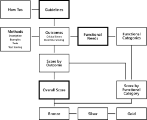

# What?

## Silverとは?

W3C WAI の Accessibility Guidelines Working Groupが、次世代のガイドラインを開発するために立ち上げたプロジェクト名

Accessibility Guidelines(Ag) を「銀」の化学記号を見立てて「Silver」と名付けられた

## WCAG 3.0とは?

Silverで開発されているガイドライン名 W3C Accessibility Guidelines 3.0の略

ちなみにWCAG2系はWeb Contents Accessibility Guidelines

名前の変更からもWeb以外の幅広い範囲を対象としていることがわかる  

<b style="color: red">※まだまだ開発中のため業務でアクセシビリティ対応するときはWCAG 3.0は参考にしないこと</b>

# Background

- 2008年12月
  - WCAG 2.0 Recommendation
- 2017~18年
  - Silver Research Project
- 2018年3月
  - Silver Design Sprint
- 2018年6月
  - WCAG 2.1 Recommendation
- 2020年2月
  - WCAG 2.2 Working Draft 公開
- 2021年1月
  - WCAG 3.0 Working Draft 公開
- 2021年6月
  - WCAG 3.0 Working Draft 更新
- 2021年12月
  - WCAG 3.0 Working Draft 更新

## Silver Research Project

2017〜2018年にかけてこれまでのアクセシビリティガイドラインの構造に対する問題点が調査された

調査結果の概要:
[Research Summary](https://docs.google.com/presentation/d/1POs7orJ4ALB0bq5_vyo4v8RxDcr-5ctwD1noVgpXuJc/edit#slide=id.gc6f73a04f_0_0)
[Problem Statements](https://www.w3.org/WAI/GL/task-forces/silver/wiki/Problem_Statements#Too_Difficult_to_Read)

加えて、大規模かつ頻繁に更新される動的なWebアプリケーションにおいてアクセシビリティの評価や適合性をどのように適用するかという課題に対する調査・提案がドキュメント化されている
[Challenges with Accessibility Guidelines Conformance and Testing, and Approaches for Mitigating Them](https://www.w3.org/TR/accessibility-conformance-challenges/)

## Silver Design Sprint

2018年3月18~19日の2日間に専門家30名ほどで行われたミーティング
- この1年間のリサーチを元に、現在のアクセシビリティガイドラインの問題点が整理された
- その問題に対する解決方法やプロトタイプが提案された

[Report of Silver Design Sprint](https://www.w3.org/community/silver/draft-final-report-of-silver/)  
[参加者リスト](https://www.w3.org/WAI/GL/task-forces/silver/wiki/Design_Sprint_Participants)

# Documents

## Requirements for WCAG 3.0

WCAG 3.0 における要件  
W3Cの勧告候補の段階で使用され、勧告候補移行の際に要件が満たされたことが報告される    

[最新Editor’s Draft](https://w3c.github.io/silver/requirements/)  
[最新Working Draft](https://www.w3.org/TR/wcag-3.0-requirements/)

## Explainer for WCAG 3.0

WCAG 3.0 の解説書
- WCAG 3.0 開発の背景
- WCAG 3.0の目標
- 設計上の決定事項の説明
- WCAG 2ガイドラインとの相違点

[最新Editor’s Draft](https://w3c.github.io/silver/explainer/)  
[最新Working Draft](https://www.w3.org/TR/wcag-3.0-explainer/)

## WCAG 3.0

https://w3c.github.io/silver/guidelines/

# Pick up from WCAG 3.0

WCAG2系と異なる部分について一部取り上げる。  
※あくまでWCAG 3.0 Working Draft で提案されているものなので変更あることが前提

- 構造
- 適合レベル
- テスト手法とスコアリング

## ガイドライン構造

## 適合レベル

各ドキュメントのWCAG2系と3.0マッピング↓  
※ 厳密には違う

| WCAG 2系          |  WCAG 3.0   |
|------------------|-----|
| Success Criteria |  Outcomes   |
| Techniques       |   Methods  |
| Understanding    |   How-to  |

## テスト手法とスコアリング

# WCAG 3.0 Schedule

## Project Plan

今はまだ新しい構造に対するフィードバック/ブラッシュアップ期間

要件や、新しいスコアリングや適合レベルに対して、フィードバックをもらいながら改善しているフェーズ。個別のガイドラインが決定されるのは2024年予定。

Recommendationになるのは2026 Q2予定。まだまだ先。。

https://github.com/w3c/silver/wiki
[WCAG 3.0 Schedule](https://docs.google.com/spreadsheets/d/1yzR1H0SnNFRELGchb_BJr4Necsrj6xVjDF1n7Tc0kTc/edit#gid=1414406908)

# 感想

- うまく構造化されて読みやすくなっている
- 解決しようとしている問題や方向性はすごく可能性を秘めていると感じた

- ガイドラインTOPページ自体がすっきりしている。アコーディオンなどをうまく活用し、みたい情報だけにアクセスできるようになっている。各周辺ドキュメントに情報をうまく移譲していてわかりやすい。
- 各ガイドラインをどう利用するかがわかるhow toというものが新設された。今まではunderstanding(達成基準に対する説明ドキュメント)しかなかったので、各ガイドラインで何をどうしたいのかがわかりにくかった。
  - 例えば: https://www.w3.org/WAI/GL/WCAG3/2021/how-tos/text-alternatives/
  - それぞれが何をすれば良いか、なぜするべきか、誰にメリットがあるかなどが平易な文で書かれていて、プランナー、デザイナー、開発者、テスター別に、何をしたら良いかが丁寧に書かれている、感動!
- WCAG2系でAAAに適合しても、実際に障害者にとって使いやすくなっているかを担保する仕組みはなかった。
- 3.0ではテストの仕組みが変わり、実際障害者が使用するハードウェアや支援技術を使用したユーザビリティテストが加わることで、実際に障害者が使いやすいかを担保できるようになるっぽい。

